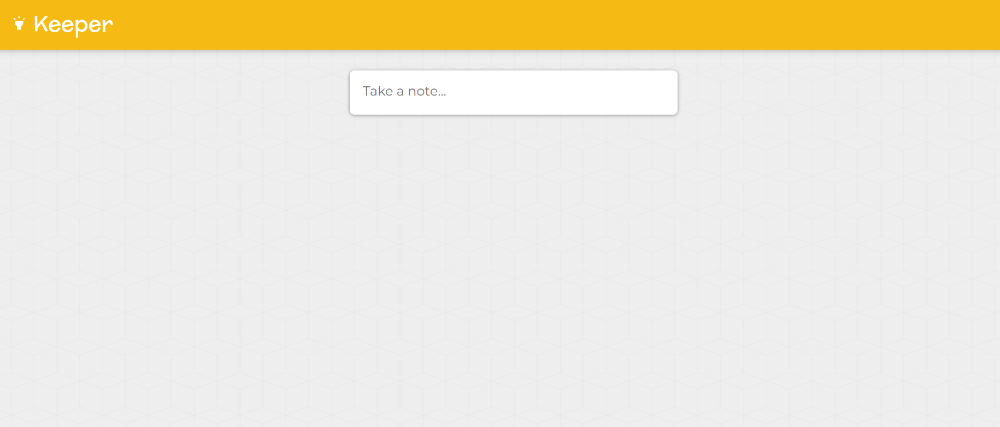
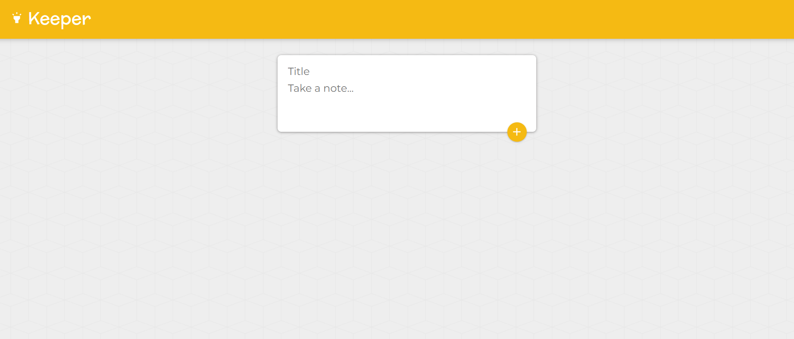
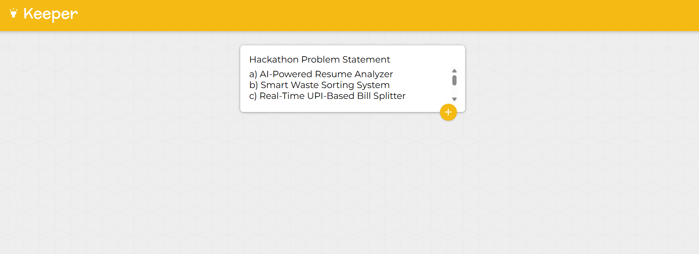
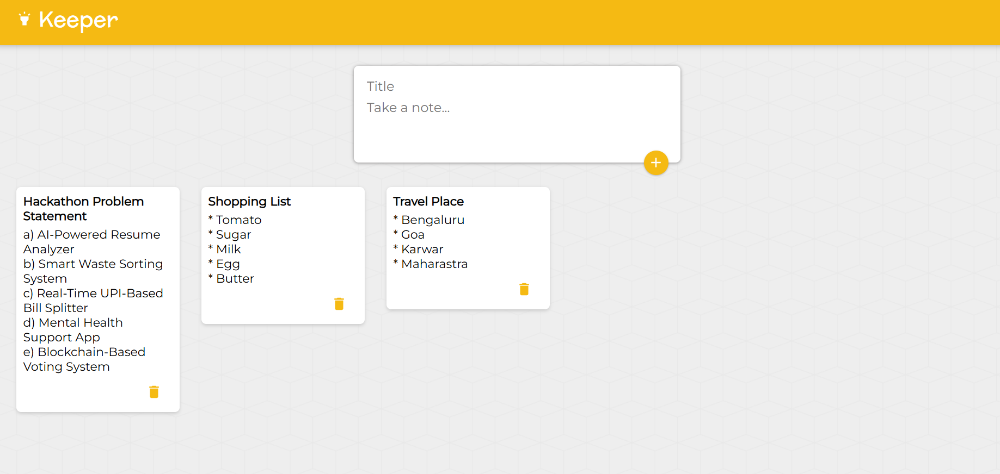

# 🗒️ Keeper App v2 — Material UI Edition

A sleek and modern **React.js application** inspired by **Google Keep**, built with **Material UI (MUI)** for beautiful UI design and responsive layout.  
This app allows users to **create, view, and delete notes dynamically** — using **React Hooks** for state management.

---

## 🖼️ Screenshots  

| 🗒️ Keeper App | 🗒️ Keeper App |
|----------------|----------------|
|  |  |

| 🗒️ Keeper App | 🗒️ Keeper App |
|----------------|----------------|
|  |  |

---

## 🛠️ Tech Stack

- ⚛️ **React.js (Hooks + Functional Components)**
- 🎨 **Material UI (MUI v7)**  
- 💻 **JavaScript (ES6)**  
- 🌐 **HTML5**  
- 🎨 **CSS3**  
- 🚀 **Vite / Create React App**

---

## 📦 Dependencies

| Package | Version | Description |
|----------|----------|-------------|
| `react` | ^18.x | Core React library |
| `@mui/material` | ^7.x | Material UI Components |
| `@mui/icons-material` | ^7.x | Material Icons |
| `@emotion/react` | ^11.x | Styling engine for MUI |
| `@emotion/styled` | ^11.x | Styled components for MUI |

---

## 🧠 How It Works

1. ✏️ Enter a **title** and **note content** in the input fields.  
2. ➕ Click the **Add (➕)** button to create a note.  
3. 📄 All notes appear in **Material UI cards** layout.  
4. ❌ Delete notes instantly with the **trash icon**.  
5. ⚡ State is managed using **React useState Hook** for dynamic updates.  

---

## ⚙️ Features

- 🧩 **Add and delete notes instantly**  
- 🧠 Built using **React Hooks (useState)**  
- 💾 **Real-time UI updates**  
- 🎨 **Material UI styling & responsive design**  
- 🧱 **Component-based architecture**  
- ⚡ **Fast and lightweight performance**

---


## ⚛️ React Installation & Application Setup

### 📦 Installation

Install the required dependencies:
```bash
npm install
```

Launch your React project in your browser
```bash
npm run dev
```
 Open [http://localhost:3000](http://localhost:3000)

